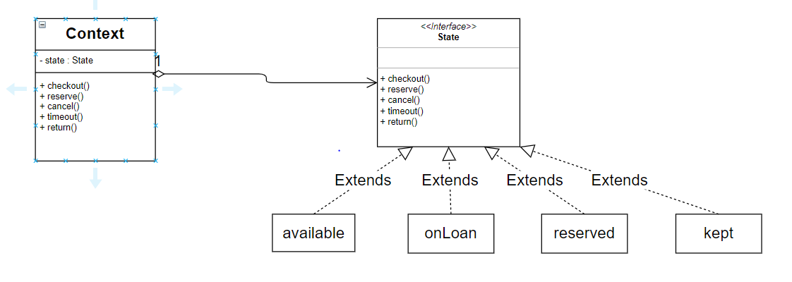
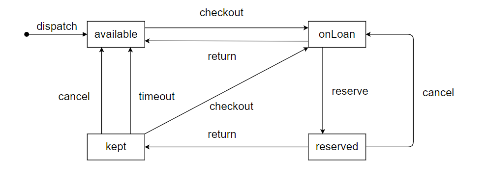

### **4\. 다음은 도서관에 보관된 책의 대출과 예약에 관한 설명이다. 이 설명을 참고해 스테이트 패턴에 기반한 책의 상태 머신 다이어그램과 클래스 다이어그램을 작성하라.**

-   책은 처음에 누구나 대출할 수 있다.
-   책이 도서관에서 체크아웃되면 대출 중 상태로 바뀐다.
-   책이 대출 중인 상태에 있을때만 예약 가능함
-   예약 중인 상태의 책이 반환되면 책은 예약자에게 대출해주기 위해 일정 기간 보관한다.
-   책이 보관 중인 상태에 있을때 예약을 취소하거나 보관 기간이 지나면 누구나 책을 대출할 수 있음.
-   대출 중인 책이 반환되면 다시 누구나 대출할 수 있음
-   책이 대출 중이거나 보관 중일때는 예약을 취소할 수 있다.

도서관 책 상태

-   이용가능
-   대출중
-   예약중
-   보관중

도서관 기능

-   대출
-   예약
-   취소
-   시간만료
-   반납

## **클래스 다이어그램**

## **상태 머신 다이어그램**

